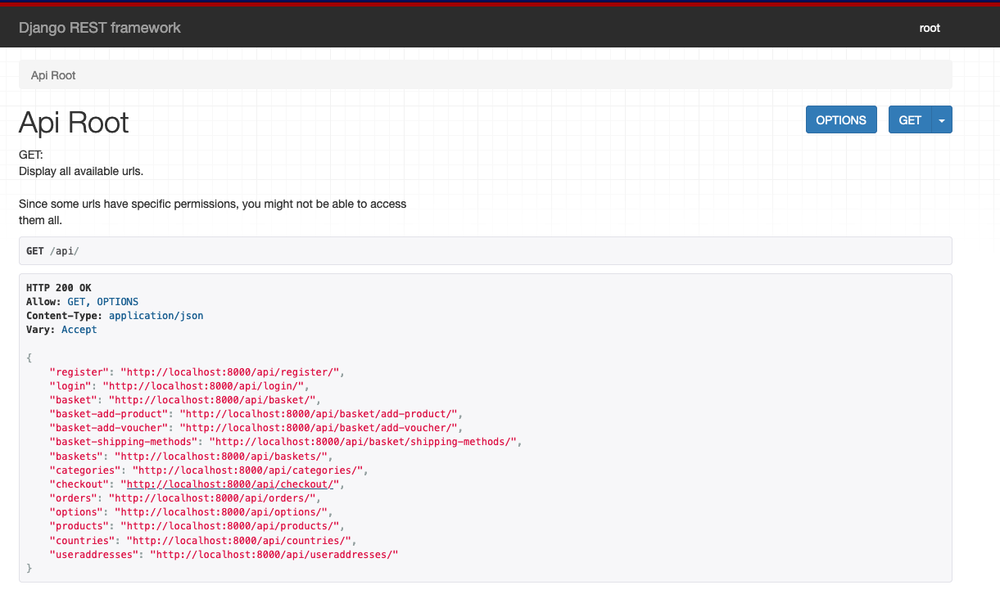

# Django Oscar

## Features

- Complete BE+template translation
- Overall features
  - Tax and shipping
  - Discounts via Vouchers
  - Payments via PayPal or Adyen
  - Multi partner option
  - Image saves as different sizes for better performance
  - Low stock alerts
  - Separate ready-to-use dashboard for admins
  - Ability to generate reports
  - Have an extension that provides drf api
- SEO
  - Google analytic support
  - SEO friendly urls
  - SEO options on image/products
- Customer features
  - Product rating + comment
  - Order history
  - Wishlist
  - Product alerts when became available

Cons 🚫
- Paypal has no support for REST API
- Outdated documentation on plugins (PayPal)
- Broken pillow dependency 'pillow>=6.0' 10.0.0 have `ANTIALIAS` deprecation
- Payment extensions are outdated and not compatible with the main oscar version

## ER diagram


## Setup your shop

- `poetry init` add `django` as the main dependency
- `django-admin startproject your_shop .`
- `poetry add 'django-oscar[sorl-thumbnail]'`
- Add to your `settings.py`
  ```python
  from oscar.defaults import *
  ```
- Add context processors and template folder
  ```python
  TEMPLATES = [
    {
        "BACKEND": "django.template.backends.django.DjangoTemplates",
        "DIRS": [os.path.join(BASE_DIR, "templates")],
        "APP_DIRS": True,
        "OPTIONS": {
            "context_processors": [
                "django.template.context_processors.debug",
                "django.template.context_processors.request",
                "django.contrib.auth.context_processors.auth",
                "django.contrib.messages.context_processors.messages",
                "oscar.apps.search.context_processors.search_form",
                "oscar.apps.checkout.context_processors.checkout",
                "oscar.apps.communication.notifications.context_processors.notifications",
                "oscar.core.context_processors.metadata",
            ],
        },
    },
  ]
  ```
- Add required apps to `INSTALLED_APPS`

  ```python
  INSTALLED_APPS = [
    'django.contrib.admin',
    'django.contrib.auth',
    'django.contrib.contenttypes',
    'django.contrib.sessions',
    'django.contrib.messages',
    'django.contrib.staticfiles',

    'django.contrib.sites',
    'django.contrib.flatpages',

    'oscar.config.Shop',
    'oscar.apps.analytics.apps.AnalyticsConfig',
    'oscar.apps.checkout.apps.CheckoutConfig',
    'oscar.apps.address.apps.AddressConfig',
    'oscar.apps.shipping.apps.ShippingConfig',
    'oscar.apps.catalogue.apps.CatalogueConfig',
    'oscar.apps.catalogue.reviews.apps.CatalogueReviewsConfig',
    'oscar.apps.communication.apps.CommunicationConfig',
    'oscar.apps.partner.apps.PartnerConfig',
    'oscar.apps.basket.apps.BasketConfig',
    'oscar.apps.payment.apps.PaymentConfig',
    'oscar.apps.offer.apps.OfferConfig',
    'oscar.apps.order.apps.OrderConfig',
    'oscar.apps.customer.apps.CustomerConfig',
    'oscar.apps.search.apps.SearchConfig',
    'oscar.apps.voucher.apps.VoucherConfig',
    'oscar.apps.wishlists.apps.WishlistsConfig',
    'oscar.apps.dashboard.apps.DashboardConfig',
    'oscar.apps.dashboard.reports.apps.ReportsDashboardConfig',
    'oscar.apps.dashboard.users.apps.UsersDashboardConfig',
    'oscar.apps.dashboard.orders.apps.OrdersDashboardConfig',
    'oscar.apps.dashboard.catalogue.apps.CatalogueDashboardConfig',
    'oscar.apps.dashboard.offers.apps.OffersDashboardConfig',
    'oscar.apps.dashboard.partners.apps.PartnersDashboardConfig',
    'oscar.apps.dashboard.pages.apps.PagesDashboardConfig',
    'oscar.apps.dashboard.ranges.apps.RangesDashboardConfig',
    'oscar.apps.dashboard.reviews.apps.ReviewsDashboardConfig',
    'oscar.apps.dashboard.vouchers.apps.VouchersDashboardConfig',
    'oscar.apps.dashboard.communications.apps.CommunicationsDashboardConfig',
    'oscar.apps.dashboard.shipping.apps.ShippingDashboardConfig',

    # 3rd-party apps that oscar depends on
    'widget_tweaks',
    'haystack',
    'treebeard',
    'sorl.thumbnail',   # Default thumbnail backend, can be replaced
    'django_tables2',
  ]
  ```

SITE_ID = 1

- Add Haystack settings

```python
HAYSTACK_CONNECTIONS = {
    "default": {
        "ENGINE": "haystack.backends.simple_backend.SimpleEngine",
    },
}
```

- Add auth backend

```python
AUTHENTICATION_BACKENDS = (
    'oscar.apps.customer.auth_backends.EmailBackend',
    'django.contrib.auth.backends.ModelBackend',
)
```

- Add middleware

```python
MIDDLEWARE = [
    "django.middleware.security.SecurityMiddleware",
    "django.contrib.sessions.middleware.SessionMiddleware",
    "django.middleware.common.CommonMiddleware",
    "django.middleware.csrf.CsrfViewMiddleware",
    "django.contrib.auth.middleware.AuthenticationMiddleware",
    "django.contrib.messages.middleware.MessageMiddleware",
    "django.middleware.clickjacking.XFrameOptionsMiddleware",
    "oscar.apps.basket.middleware.BasketMiddleware",
    "django.contrib.flatpages.middleware.FlatpageFallbackMiddleware",
]
```

## Extensions

### django-oscar-paypal

Currently don't work with django-oscar 3+

### django-oscar-api

- Install `poetry add django-oscar-api`
- Apply migration `python manage.py migrate`
- Add to urls

```python
urlpatterns = [
    ...
    path("api/", include("oscarapi.urls")),
]
```



## Summary
`django-oscar` is a more mature and refined solution for ecommerce than `django-ecommerce`
It also can be extended as a separate DRF-api for custom FE to be added.
only weak side that `django-oscar` have is their extension for payment(using legacy methods, don't support the latest version of `django-oscar`)
